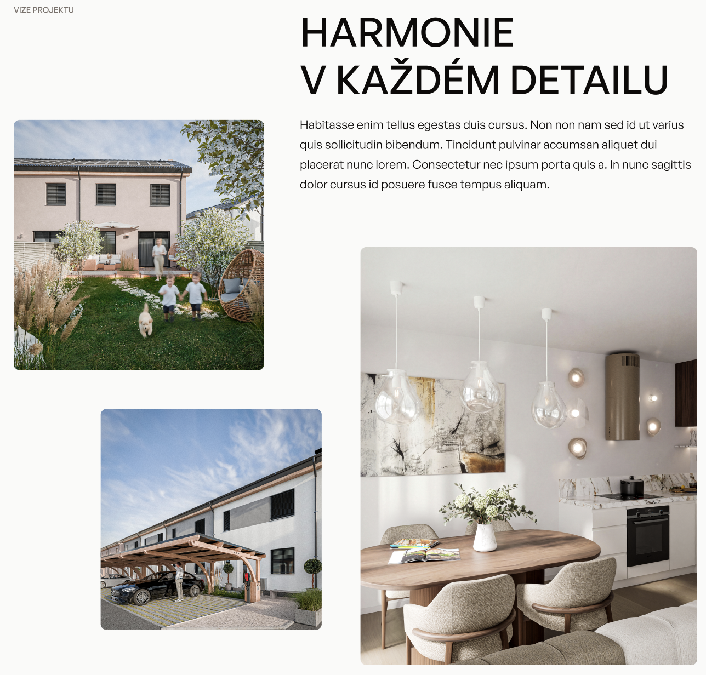
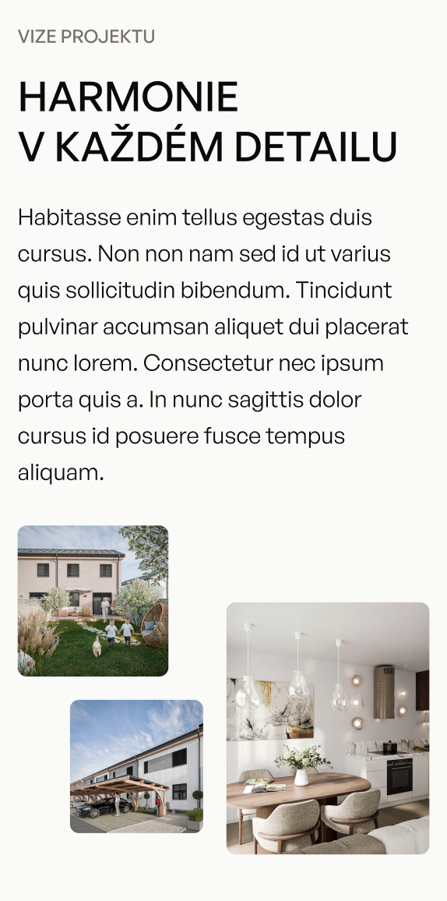

# Simple Design

A simple design implementation built with React 19, Vite, and Tailwind CSS v4.

## Tech Stack

- **React 19** — UI library
- **Vite** — build tool and dev server
- **Tailwind CSS v4** — utility-first styling (via `@tailwindcss/vite` plugin, no config file needed)

## Getting Started

**Prerequisites:** Node.js 18+

```bash
# Install dependencies
npm install

# Start development server
npm run dev
```

The app will be available at `http://localhost:5173`.

## Scripts

| Command           | Description                          |
| ----------------- | ------------------------------------ |
| `npm run dev`     | Start local dev server with HMR      |
| `npm run build`   | Build for production (`dist/`)       |
| `npm run preview` | Preview the production build locally |
| `npm run lint`    | Run ESLint                           |

## Project Structure

```
├── index.html          # Entry HTML, mounts #root
├── src/
│   ├── main.jsx        # Renders <App /> into #root
│   ├── App.jsx         # Main app component
│   ├── index.css       # Global styles (@import "tailwindcss")
│   └── assets/         # Static images
├── design/             # Design references (desktop & mobile)
└── vite.config.js
```

## Design References

Desktop and mobile mockups are in the [`design/`](./design/) folder.

| Desktop                        | Mobile                       |
| ------------------------------ | ---------------------------- |
|  |  |

## License

See [LICENSE](./LICENSE).
